# Harness for Claude Code

**harness-cicd** puts Harness inside Claude Code: your branch's build, every pipeline run, what's deployed where, approvals, freeze windows and your pull request, in one pane next to your conversation with Claude. It diagnoses failures, lets you act on runs without leaving the terminal, and keeps Claude from pushing onto a broken build or touching production without asking you.

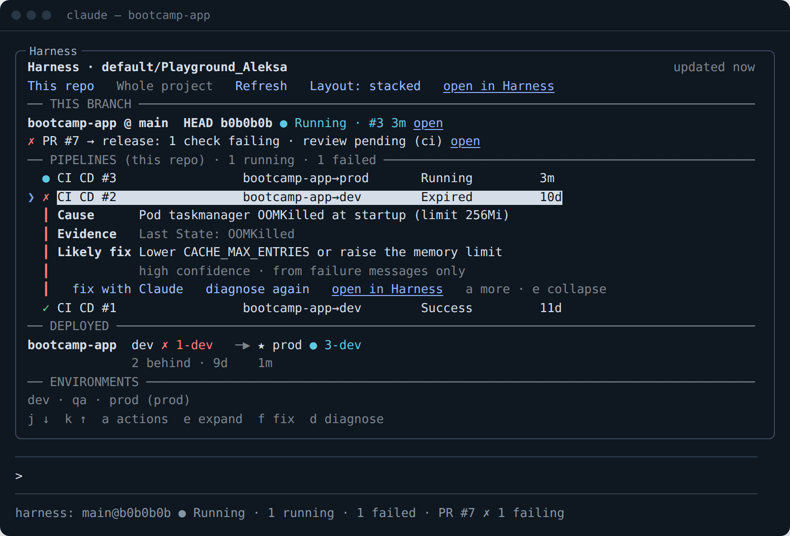

It's a Claude Code **mod**: a plugin with JavaScript hooks that draws its own interface. Everything runs on your machine and talks only to Harness (and, for diagnoses, to Claude on your own plan).

---

## Contents

- [Quick start](#quick-start)
- [A tour of the pane](#a-tour-of-the-pane)
- [Failure diagnosis](#failure-diagnosis)
- [Acting on runs](#acting-on-runs)
- [Approvals](#approvals)
- [When your build fails](#when-your-build-fails)
- [Guardrails](#guardrails)
- [Layouts](#layouts)
- [The band above the prompt and the status line](#the-band-above-the-prompt-and-the-status-line)
- [Pull requests](#pull-requests)
- [What Claude sees](#what-claude-sees)
- [`/harness doctor`](#harness-doctor)
- [Outside the terminal: text mode](#outside-the-terminal-text-mode)
- [Installing](#installing)
- [Connecting to Harness](#connecting-to-harness)
- [Reference: commands, keys, settings](#reference-commands-keys-settings)
- [How it works](#how-it-works)
- [Privacy and safety](#privacy-and-safety)
- [Troubleshooting](#troubleshooting)
- [Developing the plugin](#developing-the-plugin)
- [Known limitations](#known-limitations)
- [About the screenshots](#about-the-screenshots)

---

## Quick start

You need **Claude Code v2.1.287 or later** (`claude --version`) and access to a Harness project.

```bash
# 1. Get the plugin
git clone https://git.harness.io/8INL1LHjRmmrZQKdYtlvKA/default/Playground_Aleksa/harness-tools.git
# 2. Install it (asks for your org, project, layout, and an API key or "sign in instead")
./harness-tools/install.sh
# 3. Open Claude Code in a repo Harness builds, and type
/harness
```

If you chose to sign in instead of using an API key, do this once in Claude Code: `/mcp` → **plugin:harness-cicd:harness** → **Authenticate**. Then run `/harness doctor` to confirm everything works.

---

## A tour of the pane

Open it with `/harness`. In terminals at least 144 columns wide it also opens by itself when a session starts.


From top to bottom:

| Section | What it shows |
|---|---|
| **Header** | The Harness org/project, when it last refreshed, and badges such as an active freeze or "auto-fix on". |
| **Controls** | `1` **This repo** / `2` **Whole project**, `r` **Refresh**, `v` **Layout**, and a link to the project in Harness. |
| **This branch** | Your repo, branch and HEAD commit; whether *that exact commit* has been built, and the result; how far production is behind HEAD; the branch's open pull request. |
| **Approvals waiting** | Appears when any run in the project waits for an approval (see [Approvals](#approvals)). |
| **Pipelines** | Recent runs: status, what each built (`branch@commit`) or deployed (`service→environment`), and age. `❯` marks the selected run; failed runs open into a [diagnosis card](#failure-diagnosis). |
| **Deployed** | Promotion lanes: each service from dev to prod, the newest deployment in each environment (artifact tag and status), how many of your commits each stage is missing, and how long ago it deployed. Production is marked `★`. |
| **Environments** | Every environment in the project. |
| **Hints** | The keys that apply to the selected run. |

**"This repo" is matched automatically.** The plugin reads your git `origin` and matches it against each run's repository, so you see the runs that built *this* code and the services whose manifests live in it. If nothing matches, it falls back to runs you triggered, then to the whole project, and says so.

---

## Failure diagnosis

Every failed run shows its failure inline. Press `d` (or **diagnose** on the card) and a small Claude model reads the failed stages and steps, plus the failed step's log tail when Harness provides it, and writes the cause, the evidence, and the likely fix:

| Before | After `d` |
|---|---|
| 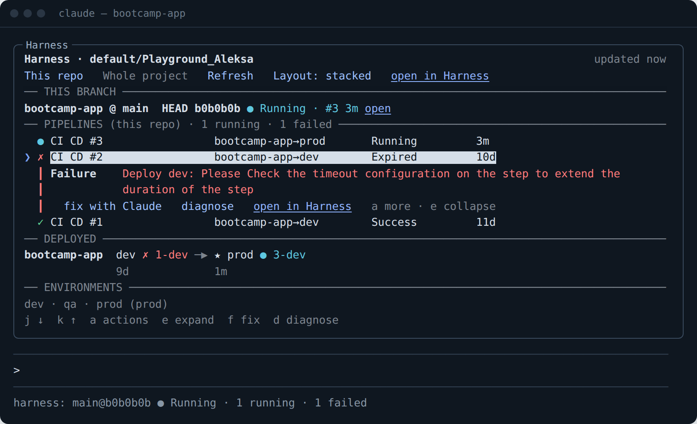 |  |

The card tells you how confident the diagnosis is and what it was based on ("read from the step log" or "from failure messages only"). From the card: **fix with Claude** starts a turn asking Claude to fix it in this repo, **diagnose again** re-runs the diagnosis, and `e` collapses it.

With the default `diagnose: auto`, failures are diagnosed as they appear, so the card is usually ready by the time you look. The same diagnosis is available as text:

```text
/harness diagnose

CI CD #2 Expired
Cause: Pod taskmanager OOMKilled at startup (limit 256Mi)
Evidence: Last State: OOMKilled
Likely fix: Lower CACHE_MAX_ENTRIES or raise the memory limit
(high confidence, from failure messages only) https://app.harness.io/ng/account/…/deployments/run2/pipeline
```

Diagnoses use a small model on your Claude plan. Set `diagnose: on_demand` to diagnose only when you press `d`, or `off` to never.

---

## Acting on runs

Select a run with `j` / `k`, then press `a` for its actions:

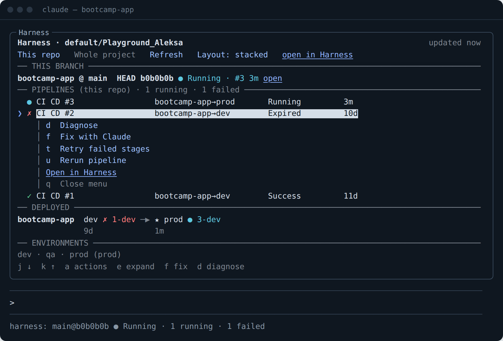

| Key | Action | Offered when | Confirmation |
|---|---|---|---|
| `d` | Diagnose | the run failed | none (read-only) |
| `f` | Fix with Claude | the run failed | none (starts a Claude turn you can stop) |
| `t` | Retry failed stages | the run failed | asks; production asks twice |
| `u` | Rerun pipeline | the run finished | asks; production asks twice |
| `x` | Abort | the run is running or waiting | asks |
| `p` / `n` | Approve / Reject | the run waits for an approval | see [Approvals](#approvals) |
| | Open in Harness | always | none |

**Write actions are off until you turn them on** (`allow_actions`, which the installer asks about). Until then they're shown greyed out with a note:

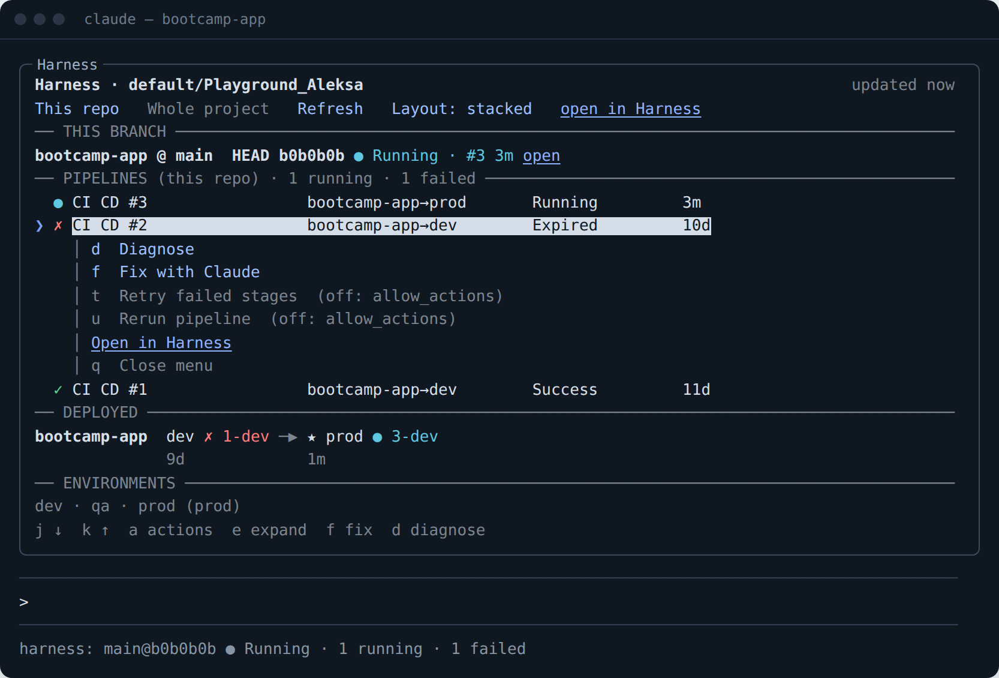

**Runtime inputs are handled for you.** Rerun and retry resend the inputs the original run used. If a run has none recorded, the pipeline's runtime inputs are asked one at a time, with defaults and allowed values offered. A pipeline with more than six inputs is handed back to Harness or Claude instead of making you answer a long quiz.

If Harness refuses an action (for example you lack permission), you see Harness's own message.

---

## Approvals

Runs waiting on an approval appear at the top of the pane, from anywhere in the project, because an approval may be yours to give in any repo:

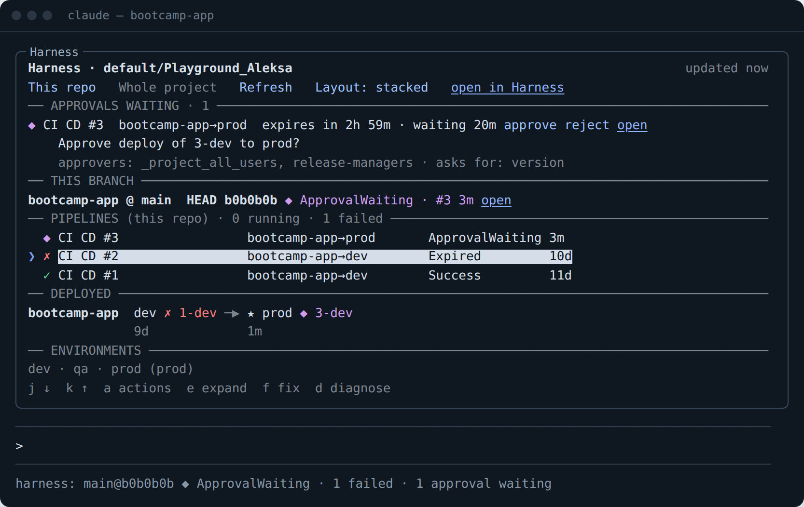

Each shows the run and where it deploys, the time left (`expires in 2h 59m`), how long it has waited, the approval message, who can approve (and how many are needed), and the inputs it asks for. A new approval is announced once with a toast, and the band and status line show the count.

**Approve** walks you through Harness's step exactly. These are the real questions, in order:

```text
Approve CI CD #3: "Approve deploy of 3-dev to prod"?        → Approve / Cancel
Value for "version"?                                         → 3-dev (default) / Cancel / type your own
This lets CI CD #3 deploy to production (prod). Approve it?  → Yes, approve for production / Cancel
✓ Approved CI CD #3
```

**Reject** asks once. Jira, ServiceNow and custom approvals are shown with where to decide them; Harness's API can approve only Harness Approval steps. Approving and rejecting need `allow_actions`.

---

## When your build fails

When a run fails **on your current HEAD commit**, the plugin diagnoses it and then, by default, asks:

```text
CI CD #3 failed on your commit: Pod taskmanager OOMKilled at startup (limit 256Mi). What now?
  → Let Claude fix it / Always auto-fix / Show the failure / Ignore
```

- **Let Claude fix it** starts a turn with the failure, the diagnosis and a link, asking Claude to find the cause, make the smallest fix, run the tests, and push. If the failure isn't caused by your code (infrastructure, a flaky test, permissions), Claude is told not to push and to explain instead.
- **Always auto-fix** switches to automatic mode and remembers it: from then on Claude fixes and pushes by itself, **at most 2 attempts per pipeline** (`auto_fix_attempts`, 1–5), then hands back with a toast. The header and band show "auto-fix on"; `/harness autofix off` goes back to asking.
- Set `on_failure: notify` to just get a toast.

---

## Guardrails

### Pushing onto a red build

When Claude is about to `git push` and your branch's latest run failed, the push waits for you:

```text
Claude wants to push, but main is red in Harness: CI CD #3 Failed (Deploy prod: Deployment did not stabilize in 10m). Push anyway?
  → Push anyway / Don't push / Show the failure
```

If you choose **Don't push**, Claude is told why, including the diagnosis, so it can fix the build first. Set `push_guard: warn` for a toast instead, or `off`. In `claude -p` (nobody to ask) the push goes ahead and is logged.

After any push, the plugin polls every 10 seconds for 15 minutes so the pane and toasts follow the pipeline the push triggered.

### Production actions

If Claude uses the Harness MCP server to run, create, update or delete anything that targets a **production** environment, you're asked first, in every permission mode, including auto mode:

```text
Claude wants to run harness_execute against production (prod). Allow it?   → Allow / Cancel
```

Production is recognized from your environments' types and names, and an approval is recognized as production-bound from the run it belongs to. With nobody to ask, the action is refused.

### Freeze windows

An active deployment freeze shows in the header, the band and the status line:

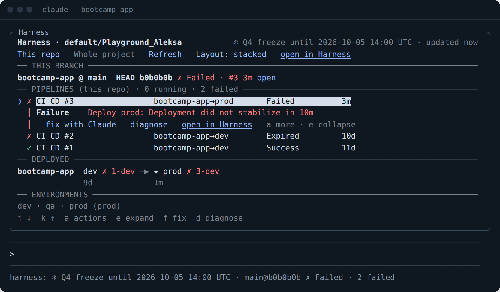

While it's active:

- Production retries, reruns and approvals from the pane are **blocked**:
  `❄ Q4 freeze until 2026-10-05 14:00 UTC: not running CI CD #3, it deploys to production. Harness blocks it unless you can override the freeze.`
- Other deploys go ahead, with the freeze named in the confirmation.
- Claude's production actions through the Harness MCP server are refused outright, not asked.
- A push gets a heads-up that the build will run but deployments may be blocked.

A freeze that's enabled but scheduled for later doesn't count; the doctor names it as the next one.

---

## Layouts

Press `v` to cycle layouts, or `/harness layout <name>`. Your choice is remembered.

**stacked** (default): everything, top to bottom, as in the screenshots above.

**focus**: one headline about your commit, the diagnosis when it failed, and one-line summaries of everything else.

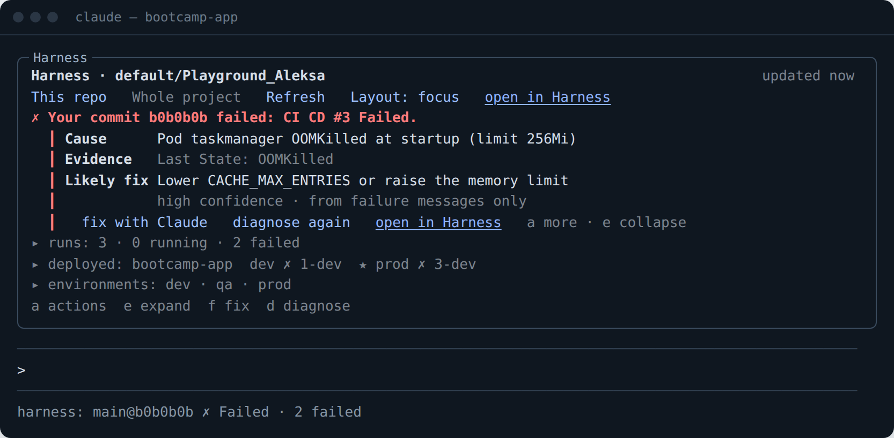

**dock**: a sidebar beside the transcript in wide fullscreen terminals, with two tabs (`w` switches): runs, and deployments listed per environment. In a regular terminal it falls back to stacked.

| Runs tab | Deployed tab |
|---|---|
| 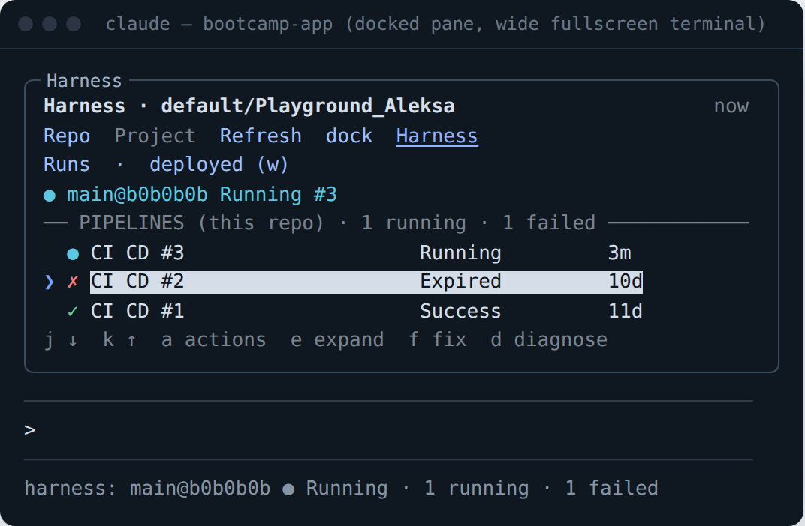 | 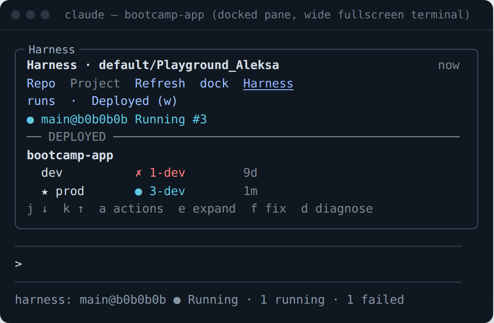 |

**strip**: no pane at start, just the [band](#the-band-above-the-prompt-and-the-status-line). The pane opens by itself when your commit fails.

---

## The band above the prompt and the status line

A single line above the prompt, always visible: your commit's status, the last 20 runs as a sparkline (green: passed, red: failed, cyan: running), how far prod is behind, the PR's checks, approvals waiting, any freeze, and `h` to open the pane. It steps aside when Claude Code needs the space for a question.

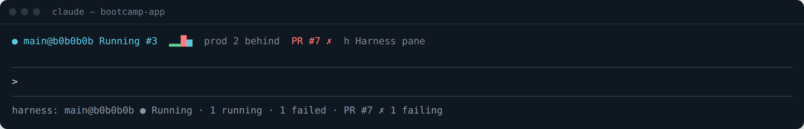

Under the prompt, the status line carries the same essentials, e.g. `harness: main@b0b0b0b ● Running · 1 running · 1 failed · PR #7 ✗ 1 failing`.

---

## Pull requests

The open pull request for your branch shows on the branch row, the band and the status line, with its checks (naming the failing ones) and review state:

```text
✗ PR #7 → release: 1 check failing · review pending (ci)
```

- **Harness Code** repos: read through the Harness API (needs an API key for now).
- **GitHub** repos: read with the GitHub CLI; install `gh` and run `gh auth login`.

---

## What Claude sees

**A tool.** Claude can call `harness_status` whenever builds or deploys come up. It returns, as compact JSON: whether HEAD is built, recent runs (status, branch, commit, what they deployed, failure, diagnosis, link), what's deployed where, how far prod is behind, waiting approvals, active freezes, and the PR. With `diagnose: <run id>` it diagnoses a run. With `scope: "all"` it covers the whole project.

**A line of context.** On prompts about building, deploying, releasing, pipelines or production, the plugin adds one short line of current Harness state, so Claude knows the situation without a tool call (`add_context`). For example:

```text
[Harness, from the harness-cicd plugin] bootcamp-app@main (HEAD b0b0b0b): HEAD is CI CD #3 Running; bootcamp-app: dev 1-dev Expired, prod 3-dev Running; prod is 2 commits behind HEAD. Call the harness_status tool for details.
```

The pane's write actions are for you, not Claude. Claude acts on Harness through the Harness MCP server, where the [guardrails](#guardrails) apply.

---

## `/harness doctor`

Read-only checks of everything the plugin uses, each with a verdict: ✓ works, ✗ fails (with Harness's message and what you lose), · for information.

```text
Harness doctor · default/Playground_Aleksa · https://app.harness.io
✓ Auth — API key (pat…), account ACC123
✓ Pipeline runs — 5 recent runs, 3 from this repo
✓ Services & environments — 2 services, 3 environments (1 production)
✓ User — dev@example.com
✓ Git — bootcamp-app @ main b0b0b0b
✗ Step details — /pipeline/api/pipelines/execution/v2/run2 → HTTP 404 (diagnosis falls back to stage messages)
✗ Step logs — log service answered HTTP 404 (diagnosis works without logs)
✓ Approvals API — readable (1 waiting on CI CD #2)
✓ Freeze windows — none active
· Runtime inputs: CI_CD — 1 (tag): rerun/retry reuse the original run's inputs, and ask for any it lacks
· Runtime inputs: guestflow_api_pipeline — 1 (tag): rerun/retry reuse the original run's inputs, and ask for any it lacks
✓ Pull requests — PR #7 → release: 1 check failing · review pending
· Behaviour — diagnose auto · on failure ask · push guard hold · prod guard on · actions off
· Write permissions — Harness checks them when you act; a refusal shows Harness's own message
```

Run it after installing, after changing your key or project, and whenever something looks off. It never changes anything in Harness. (This sample comes from the plugin's test data, where step details and logs deliberately aren't available.)

---

## Outside the terminal: text mode

Panes draw in the Claude Code terminal and the Desktop app's Code tab. In the VS Code chat panel and `claude -p`, `/harness` answers in text instead:

```text
Harness default/Playground_Aleksa — this repo
Branch bootcamp-app @ main, HEAD b0b0b0b: ● Running (#3, 3m ago) https://app.harness.io/…/deployments/run5/pipeline
Pipelines: 1 running, 0 waiting, 1 failed
  ● CI CD #3 Running 3m — bootcamp-app→prod
  ✗ CI CD #2 Expired 10d — bootcamp-app→dev
      ↳ Deploy dev: Please Check the timeout configuration on the step to extend the duration of the step
  ✓ CI CD #1 Success 11d — bootcamp-app→dev
Deployed:
  bootcamp-app — dev: ✗ 1-dev (9d) | prod: ● 3-dev (1m)
Environments: dev, qa, prod (prod)
```

The tool, context, guardrails and toasts work everywhere hooks run.

---

## Installing

### With the installer (macOS / Linux)

```bash
./harness-tools/install.sh
```

It asks for your org ID, project ID, Harness URL, layout, whether to allow write actions (default no), and your API key (hidden; press Enter to sign in with Harness instead). Then it:

1. checks Claude Code is v2.1.287 or later;
2. copies the plugin to `~/.claude-plugins/harness-tools` (you can delete the download afterwards);
3. registers the marketplace and installs `harness-cicd@harness-tools`, or updates it if already installed;
4. saves your settings; **the API key goes to your OS credential store**, never `settings.json` and never a command line;
5. runs `/harness doctor` and tells you whether it's done, or exactly what to fix.

Re-run it any time to update or change settings; press Enter at the key prompt to keep the saved key. Non-interactive:

```bash
HARNESS_API_KEY=… HARNESS_DEFAULT_ORG_ID=default HARNESS_DEFAULT_PROJECT_ID=Playground_Aleksa ./harness-tools/install.sh --yes
```

It uses no `sudo` and changes nothing outside `~/.claude-plugins` and Claude Code's own settings.

### From the repo, without the installer (any OS, including Windows)

```bash
claude plugin marketplace add https://git.harness.io/8INL1LHjRmmrZQKdYtlvKA/default/Playground_Aleksa/harness-tools.git
claude plugin install harness-cicd@harness-tools --config org_id=default --config project_id=Playground_Aleksa
```

Then in Claude Code, either `/plugin configure harness-cicd@harness-tools` to paste an API key, or `/mcp` → **plugin:harness-cicd:harness** → **Authenticate**.

### Trying it without installing

```bash
export HARNESS_API_KEY=pat.…  HARNESS_DEFAULT_ORG_ID=default  HARNESS_DEFAULT_PROJECT_ID=Playground_Aleksa
claude --plugin-dir ./harness-tools/plugins/harness-cicd
```

### Updating and removing

```bash
claude plugin marketplace update harness-tools && claude plugin update harness-cicd@harness-tools
claude plugin marketplace remove harness-tools        # removes the plugin too
```

Without settings, the pane shows what's missing:

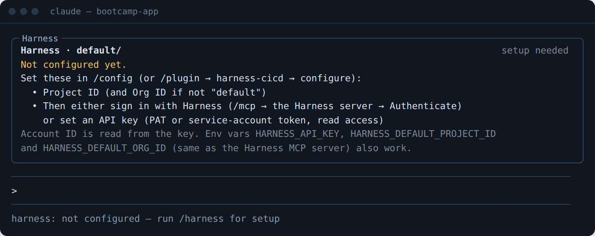

---

## Connecting to Harness

| | Sign in with Harness | API key |
|---|---|---|
| Setup | `/mcp` → **plugin:harness-cicd:harness** → **Authenticate**, once | paste a PAT or service-account token |
| How | Harness's hosted MCP server, bundled in the plugin, through Claude Code's own OAuth connection | Harness REST API |
| Requires | hosted MCP enabled for your Harness account | a key with view permissions |
| Pull requests (Harness Code) | not yet | ✓ |
| Step logs for diagnosis | through `harness_diagnose` | through the log service |

The account ID is read from the key, or from Harness's links in sign-in mode. With an API key, give it **view** access to pipelines and executions, services, environments, and freeze windows, plus Code repos for pull requests. For write actions, Harness's normal execute and approve permissions apply; the plugin never needs more than you have. A service-account key works; set `skip_user_lookup` so "runs you triggered" isn't attempted.

---

## Reference: commands, keys, settings

### Commands

| Command | Does |
|---|---|
| `/harness` | open the pane (text report where panes can't draw) |
| `/harness all` · `/harness mine` | open on the whole project / this repo |
| `/harness refresh` | refresh now |
| `/harness doctor` | read-only checks of everything |
| `/harness diagnose [run id]` | diagnose the latest failed run, or that one |
| `/harness layout <stacked\|focus\|dock\|strip>` | switch layout |
| `/harness autofix on\|off` | switch "when your build fails" between auto and ask |

### Keys (in the pane)

| Key | | Key | |
|---|---|---|---|
| `1` / `2` | this repo / whole project | `a` | actions for the selected run |
| `r` | refresh | `e` | expand / collapse the diagnosis card |
| `v` | next layout | `f` | fix with Claude |
| `j` / `k` | select next / previous run | `d` | diagnose |
| `w` | switch tab (dock layout) | `q` | close the actions menu |
| `h` | open the pane (from the band) | `Esc` | close the pane |

In the actions menu: `t` retry failed stages, `u` rerun, `x` abort, `p` approve, `n` reject.

### Settings

Set them in the installer, `/plugin configure harness-cicd@harness-tools`, or `--config key=value` at install.

| Setting | Default | |
|---|---|---|
| `api_key` | — | PAT or service-account token (stored in your OS credential store). Empty: sign in with Harness. |
| `project_id` | — | Harness project to watch (required) |
| `org_id` | `default` | Harness org |
| `account_id` | from the key | |
| `base_url` | `https://app.harness.io` | regional or self-managed Harness URL |
| `repo_name` | git `origin` | match runs to this repo name instead |
| `layout` | `stacked` | `stacked` · `focus` · `dock` · `strip` |
| `band` | `true` | the band above the prompt |
| `auto_open` | `true` | open the pane when a session starts (wide terminals) |
| `allow_actions` | `false` | retry / rerun / abort / approve / reject from the pane |
| `on_failure` | `ask` | `notify` · `ask` · `auto` |
| `auto_fix_attempts` | `2` | 1–5, for `on_failure: auto` |
| `push_guard` | `hold` | `hold` · `warn` · `off` |
| `prod_guard` | `true` | ask before Claude's Harness actions on production |
| `diagnose` | `auto` | `auto` · `on_demand` · `off` |
| `add_context` | `true` | one line of Harness state on CI/deploy prompts |
| `poll_seconds` | `60` | 15–600; 10 s while watching a push |
| `max_runs` | `50` | 10–100 recent runs per refresh |
| `skip_user_lookup` | `false` | for service-account keys |
| `mcp_server` | `plugin:harness-cicd:harness` | the Harness MCP server for sign-in mode |

### Environment variables

Read at session start; useful per shell or in CI. The first four are the same ones the Harness MCP server uses.

| Variable | Overrides |
|---|---|
| `HARNESS_API_KEY` | `api_key` (when not set) |
| `HARNESS_ACCOUNT_ID` | `account_id` |
| `HARNESS_DEFAULT_ORG_ID` · `HARNESS_DEFAULT_PROJECT_ID` | `org_id` · `project_id` |
| `HARNESS_BASE_URL` | `base_url` |
| `HARNESS_CICD_LAYOUT` | `layout` |
| `HARNESS_CICD_ON_FAILURE` · `HARNESS_CICD_PUSH_GUARD` · `HARNESS_CICD_DIAGNOSE` | those settings |
| `HARNESS_CICD_ALLOW_ACTIONS=1` | turns on `allow_actions` |

---

## How it works

The plugin is one hooks module (`hooks/register.js`) plus pure logic (`hooks/lib.js`). Claude Code loads it at session start; it registers the `/harness` command and the `harness_status` tool, then refreshes in the background:

| What | How often |
|---|---|
| runs, services, environments | every 60 s (`poll_seconds`); every 10 s for 15 minutes after a push; backs off to 2 m, 4 m, then 5 m while Harness errors |
| approvals | each refresh, for up to 5 runs that are waiting on one |
| freeze windows | every 5 minutes |
| pull request | every 2 minutes |
| git branch and HEAD | each refresh, locally |

Hooks it uses: `session.start`, `command.run`, `tool.call` (its own tool, Bash for the push guard, Harness MCP tools for the production guard), `prompt.submit` (context), and `ui.render` (the pane and the band).

### Harness APIs

Read, on every refresh:

- `POST /pipeline/api/pipelines/execution/summary`
- `GET /ng/api/servicesV2`, `GET /ng/api/environmentsV2`
- `GET /ng/api/user/currentUser` (once)

Read, when needed:

- `GET /pipeline/api/v1/orgs/{org}/projects/{project}/approvals/execution/{id}?approval_status=WAITING`
- `GET /ng/api/freeze/getGlobalFreeze`, `POST /ng/api/freeze/list`
- `GET /code/api/v1/repos/{repo}/pullreq` with `/checks` and `/reviewers`
- for a diagnosis: `GET /pipeline/api/pipelines/execution/v2/{id}`, and the log service
- before a rerun or retry: `GET …/execution/{id}/inputsetV2`, `POST /pipeline/api/inputSets/template`

Write, **only with `allow_actions` and after you confirm**:

- `POST /pipeline/api/pipeline/execute/retry/{pipeline}` (retry failed stages)
- `POST /pipeline/api/pipeline/execute/rerun/{id}/{pipeline}` (rerun)
- `PUT /pipeline/api/pipeline/execute/interrupt/{id}?interruptType=AbortAll` (abort)
- `POST /pipeline/api/approvals/{approvalId}/harness/activity` (approve / reject)

In sign-in mode the same operations go through the Harness MCP server's `harness_list`, `harness_get`, `harness_execute` and `harness_diagnose` tools.

---

## Privacy and safety

- **Where data goes.** Harness data goes only between your machine and your Harness account. For a diagnosis, the failed run's details and log tail are sent to a small Claude model on your plan. There's no telemetry.
- **Your key.** Stored in your OS credential store by Claude Code; never written to `settings.json`, logs or command lines. The debug log shows URLs and status codes, never the key.
- **Changes to Harness.** None, unless you turn on `allow_actions` and confirm each action; production asks twice, and active freezes block production outright.
- **Claude's own Harness actions.** Production actions are confirmed by you, whatever the permission mode; during a freeze they're refused.
- **Autonomy.** Auto-fix is opt-in, limited to a few attempts, visible, and tells Claude not to push when the failure isn't in your code.
- **Code you can read.** `claude plugin validate` lists every hook and every API the plugin calls.

---

## Troubleshooting

Start with `/harness doctor`; every ✗ line says what's wrong and what still works without it.

| You see | It means | Do |
|---|---|---|
| `harness: not configured` | no project ID | set `project_id` (and sign in or set a key) |
| `Harness refused the API key (HTTP 401)` | key wrong, expired, or for another account | create a new key; re-run the installer |
| `Harness sign-in needed: run /mcp …` | sign-in mode, not signed in yet | `/mcp` → **plugin:harness-cicd:harness** → **Authenticate** |
| `No runs found for repo "x"` | your git remote name differs from Harness's | set `repo_name` |
| Actions greyed out "(off: allow_actions)" | write actions are off | turn on `allow_actions` |
| `User not authorized to approve/reject` | you're not in the approval's user groups | ask an approver; the pane shows who |
| `✗ Freeze windows — could not read them` | no view permission on freeze windows | grant it; production actions aren't freeze-checked until then |
| GitHub PR not shown | `gh` missing or not signed in | install `gh`, run `gh auth login` |
| The pane never opens by itself | terminal narrower than 144 columns | type `/harness`, or widen the terminal |
| Nothing draws in VS Code | the VS Code chat panel doesn't draw panes | use the text report, or the terminal |

The plugin's log lines:

```bash
claude -p "/harness doctor" --debug-to-stderr 2>&1 | grep harness-cicd
```

---

## Developing the plugin

```text
harness-tools/
├── .claude-plugin/marketplace.json     the marketplace (one plugin)
├── .harness/harness-cicd-ci.yaml       CI pipeline (Harness Cloud)
├── install.sh                          installer
├── docs/images/                        screenshots for this README
└── plugins/harness-cicd/
    ├── .claude-plugin/plugin.json      manifest: settings, bundled Harness MCP server
    ├── hooks/hooks.json                points to the hooks module
    ├── hooks/register.js               hooks, Harness calls, rendering
    ├── hooks/lib.js                    pure logic: parsing, matching, diagnosis prompts, guards
    └── tests/                          95 tests (claude plugin test)
```

```bash
cd plugins/harness-cicd
claude plugin validate --strict ../..   # manifest, hooks, and every API the mod calls
claude plugin test                      # 95 tests, no network or sign-in needed
claude --plugin-dir .                   # try your changes in a real session
```

The tests drive the plugin through Claude Code's mod test kit: they stub Harness with responses shaped like the real APIs, press keys in the pane, answer its questions, and check what it draws and what it sends.

**CI.** The pipeline **harness-cicd plugin CI** (`harness_cicd_plugin_ci` in default / Playground_Aleksa) runs `claude plugin validate --strict` and `claude plugin test` on Harness Cloud. The trigger **On push to main** runs it on every push to `main`.

**Releasing.** Bump `version` in `plugins/harness-cicd/.claude-plugin/plugin.json`, push to `main`, wait for green. Teammates then run `claude plugin update harness-cicd@harness-tools`.

---

## Known limitations

- **Tested against documented shapes, not every account.** Paths verified only against Harness's documented API shapes so far: step-level details and logs, approval details, write actions with runtime inputs, and sign-in mode after authentication. The doctor tells you which work in your account.
- **One project at a time** (switch with `project_id`).
- **Last deployment, not live state.** The deployed view shows the last deployments in recent runs (`max_runs`), not what's live in the cluster.
- **Harness Code pull requests need an API key**; GitHub works in both modes via `gh`.
- **No log viewer.** Diagnosis reads logs for you; for the full log use **open in Harness**.
- **Polling, not push**: changes appear within the poll interval.
- **Where it draws:** panes appear in the Claude Code terminal and the Desktop app; the VS Code chat panel gets text.

---

## About the screenshots

The screenshots show **the plugin's own output**: each one is the element tree the plugin drew in a real scenario (a failed deploy, a waiting approval, an active freeze, and so on), captured through Claude Code's mod test kit with demo data and rendered as a terminal. Colours, the pane frame and spacing approximate Claude Code's default dark theme; your terminal theme will differ. The command outputs and questions quoted in this README are verbatim from the same runs, with long links shortened to `…`; the context line under [What Claude sees](#what-claude-sees) is an example of its format.
